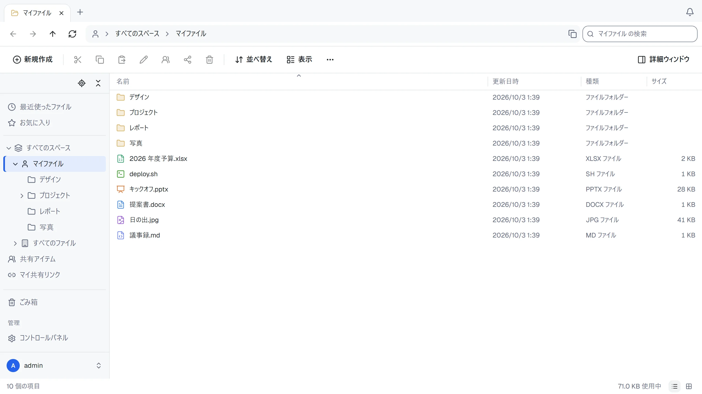

[English](README.md) · [繁體中文](README.zh-TW.md) · [简体中文](README.zh-CN.md) · 日本語


# ThirtyFile

[](https://github.com/ThirtyFile/ThirtyFile/actions/workflows/build.yml)
[](LICENSE)
[](https://github.com/ThirtyFile/ThirtyFile/pkgs/container/thirtyfile)
[](https://hub.docker.com/r/thirtyfile/thirtyfile)

Windows のエクスプローラーと同じ見た目と操作で、ブラウザーから使えるセルフホスト型のファイルマネージャーです。

**[Web サイトとガイド](https://thirtyfile.github.io/ThirtyFile/ja/)**



- タブ、フォルダーツリー、ドラッグアンドドロップ、右クリックメニュー、キーボードショートカット
- パソコンやスマートフォンでネットワークドライブとして割り当て（WebDAV）
- Word、PowerPoint、Excel をブラウザーでプレビュー。Excel とテキストファイルはオンラインで編集でき、以前のバージョンも残ります
- リンクで共有（パスワード、有効期限、ダウンロード回数の上限）。リンクでファイルを受け取ることもできます
- ファイルはローカルディスクや NAS に普通のフォルダーとして保存。S3 互換ストレージ、SFTP、FTP も使えます。既存のフォルダーをスペースにすることもできます
- 個人用、全社用、チーム用のスペースと、ロール、容量の上限
- パスワードと 2 段階認証、または Microsoft、Google、GitHub、任意の OpenID Connect プロバイダーのアカウントでサインイン
- 英語、繁体字中国語、簡体字中国語、日本語の画面、ダークモード、スマートフォン対応

## インストール

[Docker](https://docs.docker.com/get-docker/) が必要です。

**docker run**

```bash
docker run -d --name thirtyfile --restart unless-stopped \
  -p 8080:8080 \
  -v /srv/thirtyfile/data:/data \
  -v /srv/thirtyfile/storage:/storage \
  -e THIRTYFILE_ADMIN_PASSWORD='choose-a-password' \
  ghcr.io/thirtyfile/thirtyfile:latest
```

**Docker Compose**

[Docker Hub](https://hub.docker.com/r/thirtyfile/thirtyfile) でも同じイメージを提供しています。上のコマンドまたは Compose の `image:` 行で `ghcr.io/thirtyfile/thirtyfile` を `thirtyfile/thirtyfile` に置き換え、バージョンタグはそのままにしてください。

```bash
curl -fLO https://github.com/ThirtyFile/ThirtyFile/releases/latest/download/compose.yaml
docker compose up -d
```

<http://localhost:8080> を開き、`admin` でサインインします。`THIRTYFILE_ADMIN_PASSWORD` を設定しなかった場合、パスワードはランダムに作られます：`docker logs thirtyfile 2>&1 | grep password`。

`/data` にはアカウントと設定が、`/storage` にはファイルが普通のフォルダーとして保存されます：`company`、`teams/<スペース名>`、`users/<ユーザー名>`。

## ガイド

| | |
| --- | --- |
| [初期設定](https://thirtyfile.github.io/ThirtyFile/ja/docs/first-steps.html) | インストール後に設定すること |
| [Working with files](https://thirtyfile.github.io/ThirtyFile/docs/files.html)（英語） | アップロード、整理、ショートカット |
| [Sharing](https://thirtyfile.github.io/ThirtyFile/docs/sharing.html)（英語） | 共有リンク、ロール、スペース |
| [Settings](https://thirtyfile.github.io/ThirtyFile/docs/settings.html)（英語） | コンテナーの設定項目 |
| [Putting it on the internet](https://thirtyfile.github.io/ThirtyFile/docs/internet.html)（英語） | HTTPS とリバースプロキシ |
| [Upgrade and backup](https://thirtyfile.github.io/ThirtyFile/docs/backup.html)（英語） | 最新の状態と安全を保つ |
| [Troubleshooting](https://thirtyfile.github.io/ThirtyFile/docs/help.html)（英語） | よくある問題 |

## 開発

[rustup](https://rustup.rs/)（`server/rust-toolchain.toml` で指定された Rust のバージョンをインストールします）、Node 22.12 以上、pnpm 11 が必要です。

```bash
# ターミナル 1：バックエンド
cd server
THIRTYFILE_ADMIN_PASSWORD=changeme123 cargo run

# ターミナル 2：フロントエンド（http://127.0.0.1:5173）
cd web
pnpm install
pnpm dev
```

コミット前のチェックは GitHub で実行されるものと同じです。画面、サーバー、そして実際のブラウザーでサインイン、アップロード、プレビューを行うエンドツーエンドテストです（初回は `cd web && pnpm exec playwright install chromium` でブラウザーを入手してください）。

```bash
scripts/check.sh            # すべて
scripts/check.sh web        # または一部だけ：web、server、e2e、site
```

| フォルダー | 内容 |
| --- | --- |
| `server/` | バックエンド（Rust） |
| `web/` | フロントエンド（React）。翻訳は `web/src/lib/i18n/` に言語ごとのフォルダーで置かれています |
| `site/` | Web サイトとガイド。GitHub Pages で公開しています |

変更はすべて pull request で行います。[Contributing](https://thirtyfile.github.io/ThirtyFile/docs/contributing.html)（英語）をご覧ください。リリースは `main` から手動で行い、`ghcr.io/thirtyfile/thirtyfile:latest`、メジャーバージョン（`1`。1.0.0 以降、自動更新に安全なタグ）、バージョン番号のタグで公開します。各 [release](https://github.com/ThirtyFile/ThirtyFile/releases) には、Linux（amd64、arm64）向けの単一実行ファイルのサーバーと `compose.yaml` も付いています。

## ライセンス

ThirtyFile は [Apache License 2.0](LICENSE) でライセンスされています。同梱のライブラリのライセンス表示は `THIRD-PARTY-NOTICES` にあり、イメージ内の `LICENSE` の隣（`/usr/share/licenses/thirtyfile/`）と各 release に含まれています。特に明記しない限り、あなたが提供するコントリビューションも同じ条件でライセンスされます。
