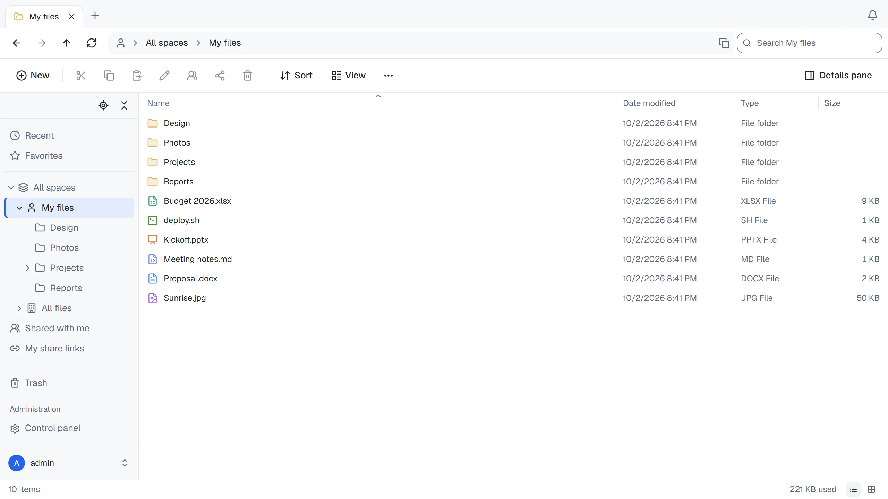

# ThirtyFile

[](https://github.com/ThirtyFile/ThirtyFile/actions/workflows/build.yml)
[](LICENSE)
[](https://github.com/ThirtyFile/ThirtyFile/pkgs/container/thirtyfile)

A self-hosted file manager that looks and works like Windows File Explorer, in your browser.

**[Website and guides](https://thirtyfile.github.io/ThirtyFile/)**



- Tabs, folder tree, drag and drop, right-click menus and keyboard shortcuts
- Preview Word, PowerPoint and Excel in the browser; edit Excel and text files online
- Share with a link: password, expiry date and download limit
- Keep files on a local disk or NAS, S3-compatible storage, SFTP or FTP
- Personal, company and team spaces, with roles and size limits
- Sign in with a password, or with Microsoft, Google or GitHub
- English and Traditional Chinese, dark mode, works on phones

## Install

You need [Docker](https://docs.docker.com/get-docker/).

**docker run**

```bash
docker run -d --name thirtyfile --restart unless-stopped \
  -p 8080:8080 \
  -v /srv/thirtyfile/data:/data \
  -v /srv/thirtyfile/storage:/storage \
  -e THIRTYFILE_ADMIN_PASSWORD='choose-a-password' \
  ghcr.io/thirtyfile/thirtyfile:latest
```

**Docker Compose**

```bash
curl -fLO https://github.com/ThirtyFile/ThirtyFile/releases/latest/download/compose.yaml
docker compose up -d
```

Open <http://localhost:8080> and sign in as `admin`. Without `THIRTYFILE_ADMIN_PASSWORD`, the password is created at random: `docker logs thirtyfile 2>&1 | grep password`.

`/data` holds accounts and settings, `/storage` holds your files.

## Guides

| | |
| --- | --- |
| [First steps](https://thirtyfile.github.io/ThirtyFile/docs/first-steps.html) | What to set up after installing |
| [Working with files](https://thirtyfile.github.io/ThirtyFile/docs/files.html) | Uploading, organising, shortcuts |
| [Sharing](https://thirtyfile.github.io/ThirtyFile/docs/sharing.html) | Share links, roles and spaces |
| [Settings](https://thirtyfile.github.io/ThirtyFile/docs/settings.html) | Options for the container |
| [Putting it on the internet](https://thirtyfile.github.io/ThirtyFile/docs/internet.html) | HTTPS and reverse proxies |
| [Upgrade and backup](https://thirtyfile.github.io/ThirtyFile/docs/backup.html) | Keeping it up to date and safe |
| [Troubleshooting](https://thirtyfile.github.io/ThirtyFile/docs/help.html) | Common problems |

## Development

You need [rustup](https://rustup.rs/) (it installs the Rust version in `server/rust-toolchain.toml`), Node 22.12+ and pnpm 11.

```bash
# Terminal 1: backend
cd server
THIRTYFILE_ADMIN_PASSWORD=changeme123 cargo run

# Terminal 2: frontend, at http://127.0.0.1:5173
cd web
pnpm install
pnpm dev
```

Checks before committing:

```bash
cd server && cargo test && cargo clippy --all-targets
cd ../web && pnpm typecheck && node scripts/check-i18n.mjs && pnpm test
```

The end-to-end test signs in, uploads and previews files in a real browser, against a server built from the repository (the first time, get the browser with `pnpm exec playwright install chromium`):

```bash
cd web && pnpm build && (cd ../server && cargo build --release) && pnpm test:e2e
```

| Folder | Contents |
| --- | --- |
| `server/` | Backend (Rust) |
| `web/` | Frontend (React). Traditional Chinese translations are in `web/src/lib/i18n/zh-TW/` |
| `site/` | The website and guides, published to GitHub Pages |

Changes go through pull requests: see [Contributing](https://thirtyfile.github.io/ThirtyFile/docs/contributing.html). Releases are made by hand from `main` and published as `ghcr.io/thirtyfile/thirtyfile:latest`, by major version (`1`, from 1.0.0 on: the safe tag for automatic updates) and by version number; the [releases](https://github.com/ThirtyFile/ThirtyFile/releases) also carry the server as a single program for Linux (amd64, arm64) and `compose.yaml`.

## License

ThirtyFile is licensed under the [Apache License 2.0](LICENSE). The licence notices of the libraries it includes are in `THIRD-PARTY-NOTICES`, next to `LICENSE` in the image (`/usr/share/licenses/thirtyfile/`) and on each release. Unless you state otherwise, any contribution you submit for inclusion is licensed under the same terms.
