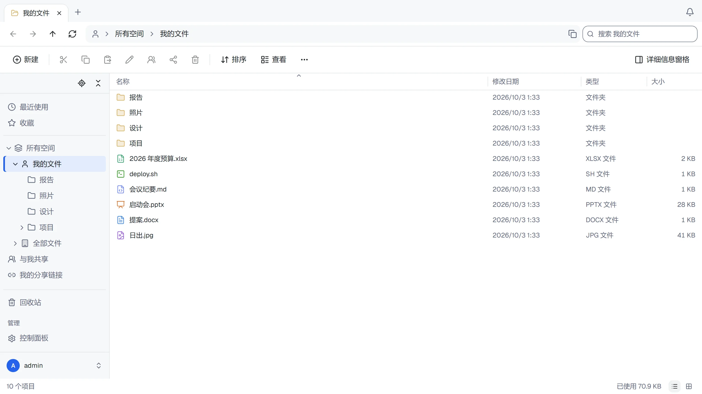

[English](README.md) · [繁體中文](README.zh-TW.md) · 简体中文 · [日本語](README.ja.md)


# ThirtyFile

[](https://github.com/ThirtyFile/ThirtyFile/actions/workflows/build.yml)
[](LICENSE)
[](https://github.com/ThirtyFile/ThirtyFile/pkgs/container/thirtyfile)
[](https://hub.docker.com/r/thirtyfile/thirtyfile)

可以自托管的文件管理工具，界面和操作都像 Windows 文件资源管理器，在浏览器中使用。

**[网站和指南](https://thirtyfile.github.io/ThirtyFile/zh-CN/)**



- 标签页、文件夹树、拖放、右键菜单和键盘快捷键
- 在电脑或手机上映射为网络驱动器（WebDAV）
- 在浏览器中预览 Word、PowerPoint 和 Excel；在线编辑 Word 文档的文字、Excel 和文本文件，并保留历史版本
- 通过链接分享（密码、有效期、下载次数限制），或通过链接接收文件
- 文件以普通文件夹的形式保存在本地磁盘或 NAS 上，也可以保存在兼容 S3 的存储、SFTP 或 FTP 上；已有的文件夹也可以作为一个空间
- 个人、公司和团队空间，带角色和容量上限
- 使用密码加两步验证登录，或使用 Microsoft、Google、GitHub 以及任何 OpenID Connect 服务的账号
- 英文、繁体中文、简体中文和日文界面、深色模式，手机上也能用

## 安装

需要 [Docker](https://docs.docker.com/get-docker/)。

**docker run**

```bash
docker run -d --name thirtyfile --restart unless-stopped \
  -p 8080:8080 \
  -v /srv/thirtyfile/data:/data \
  -v /srv/thirtyfile/storage:/storage \
  -e THIRTYFILE_ADMIN_PASSWORD='choose-a-password' \
  ghcr.io/thirtyfile/thirtyfile:latest
```

**Docker Compose**

[Docker Hub](https://hub.docker.com/r/thirtyfile/thirtyfile) 也提供相同的镜像。将上方命令或 Compose 的 `image:` 中的 `ghcr.io/thirtyfile/thirtyfile` 改为 `thirtyfile/thirtyfile`，保留相同的版本标签即可。

```bash
curl -fLO https://github.com/ThirtyFile/ThirtyFile/releases/latest/download/compose.yaml
docker compose up -d
```

打开 <http://localhost:8080>，以 `admin` 登录。未设置 `THIRTYFILE_ADMIN_PASSWORD` 时，密码会随机生成：`docker logs thirtyfile 2>&1 | grep password`。

`/data` 保存账号和设置，`/storage` 以普通文件夹保存你的文件：`company`、`teams/<空间名称>` 和 `users/<用户名>`。

## 指南

| | |
| --- | --- |
| [初始设置](https://thirtyfile.github.io/ThirtyFile/zh-CN/docs/first-steps.html) | 安装后需要设置的内容 |
| [Working with files](https://thirtyfile.github.io/ThirtyFile/docs/files.html)（英文） | 上传、整理、快捷键 |
| [Sharing](https://thirtyfile.github.io/ThirtyFile/docs/sharing.html)（英文） | 分享链接、角色和空间 |
| [Settings](https://thirtyfile.github.io/ThirtyFile/docs/settings.html)（英文） | 容器的设置选项 |
| [Putting it on the internet](https://thirtyfile.github.io/ThirtyFile/docs/internet.html)（英文） | HTTPS 和反向代理 |
| [Upgrade and backup](https://thirtyfile.github.io/ThirtyFile/docs/backup.html)（英文） | 保持更新和数据安全 |
| [Troubleshooting](https://thirtyfile.github.io/ThirtyFile/docs/help.html)（英文） | 常见问题 |

## 开发

需要 [rustup](https://rustup.rs/)（它会安装 `server/rust-toolchain.toml` 中指定的 Rust 版本）、Node 22.12 及以上和 pnpm 11。

```bash
# 终端 1：后端
cd server
THIRTYFILE_ADMIN_PASSWORD=changeme123 cargo run

# 终端 2：前端，地址为 http://127.0.0.1:5173
cd web
pnpm install
pnpm dev
```

提交前的检查与 GitHub 上运行的相同：界面、服务器，以及在真实浏览器中登录、上传和预览文件的端到端测试（第一次运行前，请先用 `cd web && pnpm exec playwright install chromium` 获取浏览器）：

```bash
scripts/check.sh            # 全部
scripts/check.sh web        # 或其中一部分：web、server、e2e 或 site
```

| 文件夹 | 内容 |
| --- | --- |
| `server/` | 后端（Rust） |
| `web/` | 前端（React）。翻译在 `web/src/lib/i18n/`，每种语言一个文件夹 |
| `site/` | 网站和指南，发布到 GitHub Pages |

所有变更都通过 pull request 进行：请参阅 [Contributing](https://thirtyfile.github.io/ThirtyFile/docs/contributing.html)（英文）。版本从 `main` 手动发布，发布为 `ghcr.io/thirtyfile/thirtyfile:latest`、主版本号（`1`，从 1.0.0 起：适合自动更新的标签）和完整版本号；每个 [release](https://github.com/ThirtyFile/ThirtyFile/releases) 还附带 Linux（amd64、arm64）的单文件服务器程序和 `compose.yaml`。

## 许可证

ThirtyFile 采用 [Apache License 2.0](LICENSE) 许可证。其中包含的库的许可声明在 `THIRD-PARTY-NOTICES` 中，位于镜像里 `LICENSE` 旁边（`/usr/share/licenses/thirtyfile/`），每个 release 也会附带。除非你另有声明，你提交的任何贡献都按相同条款授权。
