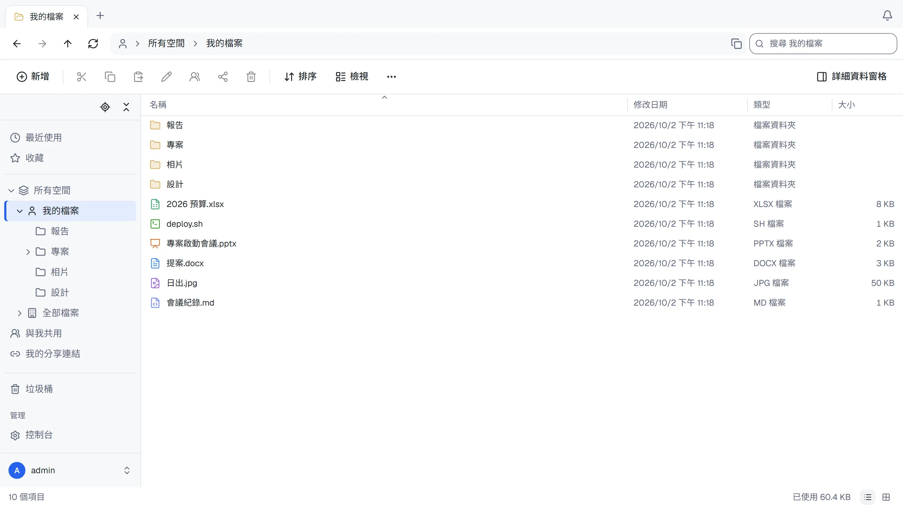

[English](README.md) · 繁體中文 · [简体中文](README.zh-CN.md) · [日本語](README.ja.md)


# ThirtyFile

[](https://github.com/ThirtyFile/ThirtyFile/actions/workflows/build.yml)
[](LICENSE)
[](https://github.com/ThirtyFile/ThirtyFile/pkgs/container/thirtyfile)
[](https://hub.docker.com/r/thirtyfile/thirtyfile)

可以自行架設的檔案管理工具，外觀與操作都像 Windows 檔案總管，在瀏覽器中使用。

**[網站與指南](https://thirtyfile.github.io/ThirtyFile/zh-TW/)**



- 分頁、資料夾樹狀結構、拖放、右鍵選單與鍵盤快速鍵
- 在電腦或手機上連線為網路磁碟機（WebDAV）
- 在瀏覽器中預覽 Word、PowerPoint 與 Excel；線上編輯 Excel 與文字檔，並保留先前的版本
- 用連結分享（密碼、到期日、下載次數上限），或透過連結收取檔案
- 檔案以一般資料夾的形式存放在本機磁碟或 NAS，也可以放在相容 S3 的儲存服務、SFTP 或 FTP；既有的資料夾也能成為一個空間
- 個人、公司與團隊空間，有角色與容量上限
- 以密碼加兩步驟驗證登入，或使用 Microsoft、Google、GitHub 及任何 OpenID Connect 服務的帳號
- 英文、繁體中文、簡體中文與日文介面、深色模式，手機也能用

## 安裝

需要 [Docker](https://docs.docker.com/get-docker/)。

**docker run**

```bash
docker run -d --name thirtyfile --restart unless-stopped \
  -p 8080:8080 \
  -v /srv/thirtyfile/data:/data \
  -v /srv/thirtyfile/storage:/storage \
  -e THIRTYFILE_ADMIN_PASSWORD='choose-a-password' \
  ghcr.io/thirtyfile/thirtyfile:latest
```

**Docker Compose**

[Docker Hub](https://hub.docker.com/r/thirtyfile/thirtyfile) 也提供相同的映像。將上方指令或 Compose 的 `image:` 中的 `ghcr.io/thirtyfile/thirtyfile` 改成 `thirtyfile/thirtyfile`，保留相同的版本標籤即可。

```bash
curl -fLO https://github.com/ThirtyFile/ThirtyFile/releases/latest/download/compose.yaml
docker compose up -d
```

開啟 <http://localhost:8080>，以 `admin` 登入。沒有設定 `THIRTYFILE_ADMIN_PASSWORD` 時，密碼會隨機產生：`docker logs thirtyfile 2>&1 | grep password`。

`/data` 存放帳號與設定，`/storage` 以一般資料夾存放你的檔案：`company`、`teams/<空間名稱>` 與 `users/<使用者名稱>`。

## 指南

| | |
| --- | --- |
| [初次設定](https://thirtyfile.github.io/ThirtyFile/zh-TW/docs/first-steps.html) | 安裝後要設定的事 |
| [Working with files](https://thirtyfile.github.io/ThirtyFile/docs/files.html)（英文） | 上傳、整理、快速鍵 |
| [Sharing](https://thirtyfile.github.io/ThirtyFile/docs/sharing.html)（英文） | 分享連結、角色與空間 |
| [Settings](https://thirtyfile.github.io/ThirtyFile/docs/settings.html)（英文） | 容器的設定選項 |
| [Putting it on the internet](https://thirtyfile.github.io/ThirtyFile/docs/internet.html)（英文） | HTTPS 與反向代理 |
| [Upgrade and backup](https://thirtyfile.github.io/ThirtyFile/docs/backup.html)（英文） | 保持最新與安全 |
| [Troubleshooting](https://thirtyfile.github.io/ThirtyFile/docs/help.html)（英文） | 常見問題 |

## 開發

需要 [rustup](https://rustup.rs/)（它會安裝 `server/rust-toolchain.toml` 指定的 Rust 版本）、Node 22.12 以上與 pnpm 11。

```bash
# 終端機 1：後端
cd server
THIRTYFILE_ADMIN_PASSWORD=changeme123 cargo run

# 終端機 2：前端，在 http://127.0.0.1:5173
cd web
pnpm install
pnpm dev
```

提交前的檢查與 GitHub 上執行的相同：介面、伺服器，以及在真實瀏覽器中登入、上傳與預覽檔案的端對端測試（第一次請先用 `cd web && pnpm exec playwright install chromium` 取得瀏覽器）：

```bash
scripts/check.sh            # 全部
scripts/check.sh web        # 或其中一部分：web、server、e2e 或 site
```

| 資料夾 | 內容 |
| --- | --- |
| `server/` | 後端（Rust） |
| `web/` | 前端（React）。翻譯在 `web/src/lib/i18n/`，每種語言一個資料夾 |
| `site/` | 網站與指南，發佈到 GitHub Pages |

變更都透過 pull request 進行：請參閱 [Contributing](https://thirtyfile.github.io/ThirtyFile/docs/contributing.html)（英文）。版本由 `main` 手動發佈，發佈為 `ghcr.io/thirtyfile/thirtyfile:latest`、主版本號（`1`，從 1.0.0 起：適合自動更新的標籤）與完整版本號；每個 [release](https://github.com/ThirtyFile/ThirtyFile/releases) 也附有 Linux（amd64、arm64）的單一執行檔伺服器與 `compose.yaml`。

## 授權

ThirtyFile 採用 [Apache License 2.0](LICENSE) 授權。所含函式庫的授權聲明在 `THIRD-PARTY-NOTICES`，位於映像檔中 `LICENSE` 旁（`/usr/share/licenses/thirtyfile/`），每個 release 也都附上。除非你另有說明，你提交的任何貢獻都以相同條款授權。
